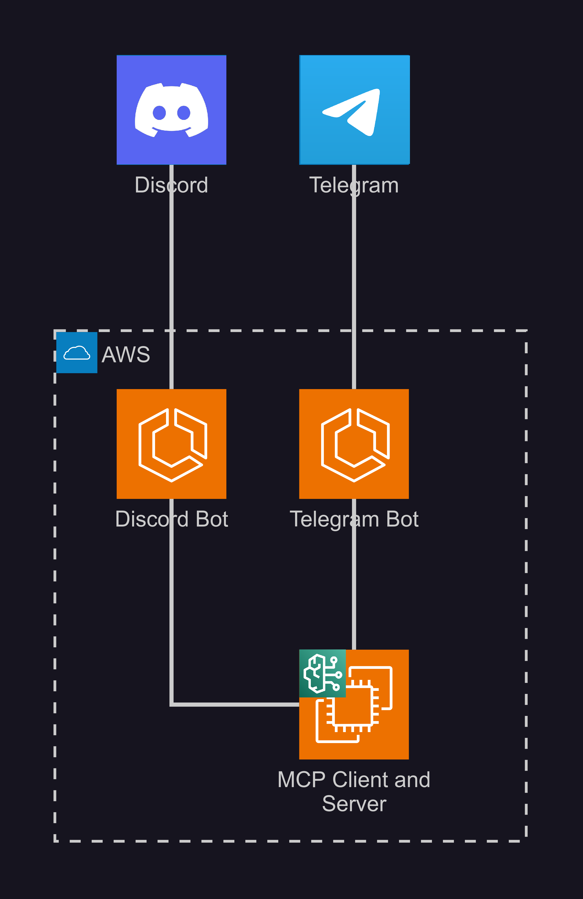

# Great Malaysia AI Hackathon 2025 : MyGovLink

# Demo Video
https://youtu.be/8qvh84r3TJU

## Team ARMVD
Anas  
Rawad  
Muhammad Hafiz  
Vincent  
Daven

## Problem Statement

AI agent with MCP (Model Context Protocol) backend connecting to multiple government bodies with a query-able chatbot which allows you to renew your licenses, pay summons, all through whatsapp like messaging tools.

## Purpose

MyGovLink AI is a unified, secure, and conversational AI agent designed to simplify interactions
with Malaysian government services. Citizens can perform critical tasks like renewing licenses
and paying summons through a simple chat interface on platforms like [Discord](https://t.me/telegram) or [Telegram](https://t.me/telegram).
The backend architecture is built on a [Model Context Protocol (MCP)](https://modelcontextprotocol.io/docs/getting-started/intro) pattern, using AWS
services to intelligently orchestrate requests across multiple, siloed government agency APIs,
providing a single, seamless experience for the user.

---

## System Architecture
Detailed Overview

Simplified Overview

## Scalabilty of Solution

The client-facing side of our product leverages on 3rd party apps like Discord and Telegram which has millions of users, so our product is able to handle many potential users. Furthermore, AWS Bedrock provides elastic scaling for natural language processing, ensuring that the system can handle fluctuating volumes of citizen queries without manual infrastructure management. In adition, AWS ECS and EC2 provide a controlled compute layer for workloads that require persistent connections, specialized runtimes, or more predictable scaling. ECS enables containerized services to scale horizontally by running more tasks as demand increases, while EC2 Auto Scaling Groups allow compute resources to grow or shrink dynamically to match traffic patterns. This hybrid design ensures flexibility, as ECS/EC2 deliver stable scaling for long-running or stateful services. 

## Future Plans

In the future, we can transform the current monolithic MCP server into a set of microservices. By decomposing the monolithic system into smaller, domain-specific services—for example, separate services for license renewals, summons payments, authentication, and notifications—we can reduce bottlenecks and scale individual components independently based on demand. These microservices can then be orchestrated using Kubernetes, hosted within Amazon EKS, which provides automated scaling, self-healing, and rolling updates.  

## External Repos

Discord Bot and Telegram Bot were developed in other repositories. Here are their links:  

Discord Bot: https://github.com/vinmeil/govlink-bot  
Telegram Bot: https://github.com/rawaddddd/MyGovLinkAITelegramBot  
Landing Page: Here  
MCP Client and Server: Here  
